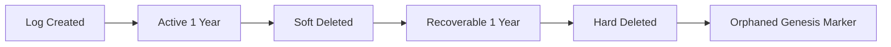
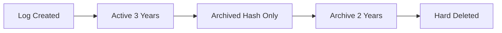
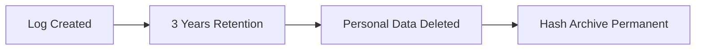

<!--
SPDX-FileCopyrightText: 2025 SecPal Contributors
SPDX-License-Identifier: AGPL-3.0-or-later
-->
<!-- markdownlint-disable MD034 MD036 MD040 -->

# Activity Logging Admin Guide

**Version:** 1.0
**Last Updated:** December 27, 2025
**Target Audience:** System Administrators, Operations Teams

---

## 📋 Table of Contents

1. [Introduction](#introduction)
2. [Configuration](#configuration)
3. [Retention Policies](#retention-policies)
4. [Manual Commands](#manual-commands)
5. [Log Integrity Verification](#log-integrity-verification)
6. [Troubleshooting](#troubleshooting)
7. [Performance Optimization](#performance-optimization)
8. [Monitoring & Alerts](#monitoring--alerts)

---

## Introduction

SecPal's Activity Logging System implements ADR-010 (Activity Logging & Audit Trail Strategy) with a 3-tier security model compliant with:

- **BewachV §21 Abs. 4** (German Private Security Regulation)
- **GDPR Article 30** (Records of Processing Activities)
- **GDPR Article 32** (Security of Processing)

### Architecture Overview

```
┌──────────────────────────────────────────────────────────┐
│ Level 1: Standard Logs (1 year retention)               │
│ → Hash Chain → Soft Delete → Hard Delete                │
└──────────────────────────────────────────────────────────┘
                       ↓
┌──────────────────────────────────────────────────────────┐
│ Level 2: Security-Critical (3 years retention)          │
│ → Hash Chain + Merkle Tree → Archive → Delete           │
└──────────────────────────────────────────────────────────┘
                       ↓
┌──────────────────────────────────────────────────────────┐
│ Level 3: Legal-Critical (7 years permanent)             │
│ → Hash Chain + Merkle Tree + OpenTimestamp → Permanent  │
└──────────────────────────────────────────────────────────┘
```

### Key Features

- **Tamper-Proof:** SHA256 hash chains detect modifications
- **Verifiable:** Merkle tree batching for efficient verification
- **Legally Admissible:** Bitcoin-anchored timestamps via OpenTimestamp
- **GDPR-Compliant:** Automated data minimization and deletion
- **Performance:** Queue-based processing, no race conditions

---

## Configuration

### Config File: `config/activitylog.php`

```php
return [
    /*
     * Security Levels & Retention Policy
     */
    'security_levels' => [
        'basic' => [
            'delete_records_older_than_years' => 3,  // BewachV minimum
            'enable_hash_chain' => false,
            'enable_merkle_tree' => false,
            'enable_opentimestamp' => false,
        ],
        'enhanced' => [
            'delete_records_older_than_years' => 5,
            'enable_hash_chain' => true,
            'enable_merkle_tree' => false,
            'enable_opentimestamp' => false,
        ],
        'forensic' => [
            'delete_records_older_than_years' => 3,  // BewachV § 21 minimum
            'enable_hash_chain' => true,
            'enable_merkle_tree' => true,
            'enable_opentimestamp' => true,
        ],
    ],

    /*
     * Default security level for new logs
     */
    'default_log_level' => 'basic',

    /*
     * OpenTimestamp Configuration
     */
    'opentimestamp' => [
        'calendar_servers' => [
            'https://alice.btc.calendar.opentimestamps.org',
            'https://bob.btc.calendar.opentimestamps.org',
        ],
        'timeout' => 10,  // seconds
        'enable_bitcoin_verification' => env('OTS_ENABLE_BITCOIN', true),
    ],
];
```

### Environment Variables

```bash
# .env file

# OpenTimestamp Configuration
OTS_ENABLE_BITCOIN=true
OTS_CALENDAR_SERVERS=https://alice.btc.calendar.opentimestamps.org,https://bob.btc.calendar.opentimestamps.org

# Activity Log Performance
ACTIVITY_LOG_QUEUE=default
MERKLE_TREE_BATCH_SIZE=1000
```

---

## Retention Policies

### Retention Strategy Overview

| Level | Log Types           | Soft Delete    | Hard Delete   | Personal Data Deleted    | Hashes Retained                |
| ----- | ------------------- | -------------- | ------------- | ------------------------ | ------------------------------ |
| **1** | Standard Operations | After 1 year   | After 2 years | After 2 years            | None                           |
| **2** | Security-Critical   | N/A (archived) | After 5 years | After 3 years (archived) | Until 5 years                  |
| **3** | Legal-Critical      | N/A            | After 3 years | After 3 years            | Permanent (hash-only archives) |

### Detailed Retention Flow

#### Level 1: Standard Activity Logs



**Timeline Example:**

- **March 15, 2023:** Log created (`employee_changes`)
- **December 31, 2024:** Soft deleted (end of following calendar year)
- **December 31, 2025:** Hard deleted (2 years total)
- **Successor log:** Marked as `is_orphaned_genesis = true`

**Why Orphaned Genesis?**
When a log is hard-deleted, the hash chain would break. To maintain integrity, the **next log in the chain** is marked as "orphaned genesis" with metadata explaining the legitimate deletion.

---

#### Level 2: Security-Critical Logs



**Timeline Example:**

- **January 10, 2023:** Log created (`authentication` - failed login)
- **December 31, 2026:** Archived (end of 3rd following year)
  - Personal data deleted: `properties`, `subject`, `causer`
  - Retained in `activity_log_archive`: `event_hash`, `previous_hash`, `merkle_root`
- **December 31, 2028:** Archive hard deleted (5 years total)

**GDPR Compliance:**

- Personal data removed after 3 years (Article 5(1)(e) - Storage Limitation)
- Cryptographic hashes retained 2 additional years for verification
- Hashes are NOT personal data (GDPR Recital 26)

---

#### Level 3: Legal-Critical Logs



**Timeline Example:**

- **July 5, 2023:** Log created (`hr_access` - salary data access)
- **December 31, 2026:** Retention period ends (BewachV § 21 Abs. 4)
- **January 1, 2027:** Personal data deleted, hash-only archive created
- **Permanent:** Cryptographic hashes retained for verification (GDPR Article 5(1)(e) compliant)

**Legal Justification:**

- **BewachV § 21 Abs. 4:** Security industry records 3 years minimum
- **GDPR Article 5(1)(e):** Storage limitation - personal data deleted after retention period
- **GDPR Recital 26:** Hashes are NOT personal data if properly anonymized
- **OpenTimestamp proof:** Court-admissible evidence remains verifiable

**Extended Retention (Optional):**
If your organization requires longer retention (e.g., HGB § 257: 6-10 years for business records, AO § 147: 10 years for tax-relevant documents), configure extended periods:

```php
// config/activitylog.php - Extended compliance
'forensic' => [
    'delete_records_older_than_years' => 10,  // HGB/AO compliance
],
```

⚠️ **Important:** Consult your legal counsel or tax advisor to determine if activity logs qualify as "business records" (HGB/AO) for your specific use case.

---

### Scheduled Retention Job

Retention policies are applied automatically via Laravel Scheduler:

```php
// routes/console.php
Schedule::command('activity:apply-retention')
    ->dailyAt('02:00')
    ->name('activity-retention');
```

**When it runs:**

- **Daily at 02:00 AM** (server timezone)
- **Non-blocking:** Uses database chunking (1000 records per batch)
- **Logged:** All actions logged to `storage/logs/laravel.log`

---

## Manual Commands

### 1. Apply Retention Policies

**Command:**

```bash
php artisan activity:apply-retention
```

**Options:**

```bash
# Dry run (preview only, no changes)
php artisan activity:apply-retention --dry-run

# Apply only specific level(s)
php artisan activity:apply-retention --level=1
php artisan activity:apply-retention --level=2,3

# Verbose output
php artisan activity:apply-retention -v
```

**Example Output:**

```
Starting retention policy application...
Dry run: NO

Level 1: Soft-deleting logs older than 1 year...
✓ Soft deleted 1,234 Level 1 logs
✓ Hard deleted 567 soft-deleted logs (2 years old)
✓ Created 567 orphaned genesis markers

Level 2: Archiving logs older than 3 years...
✓ Archived 890 Level 2 logs (hash only)
✓ Hard deleted 234 archived logs (5 years old)

Level 3: Applying retention after 3 years...
✓ Personal data deleted from 450 Level 3 logs
✓ Hash-only archives created (permanent verification)

Level 3: No action (permanent retention)

Retention policies applied successfully.
```

**Dry Run Output:**

```
Dry run: YES
Would soft-delete: 1,234 Level 1 logs
Would hard-delete: 567 soft-deleted logs
Would create: 567 orphaned genesis markers
Would archive: 890 Level 2 logs
Would hard-delete archives: 234 archived logs
No changes made.
```

---

### 2. Build Merkle Tree Batch

**Command:**

```bash
php artisan activity:build-merkle-batch
```

**Purpose:**

- Manually trigger Merkle tree building for Level 2+3 logs
- Normally runs automatically (hourly via scheduler)

**Example Output:**

```
Building Merkle tree batch...
Processing tenant #1: 234 unbatched logs
Processing tenant #2: 567 unbatched logs
Merkle tree batch #1735318800 complete.
```

---

### 3. Submit OpenTimestamp Proofs

**Command:**

```bash
php artisan activity:submit-opentimestamp
```

**Purpose:**

- Submit Merkle roots to OpenTimestamp calendar servers
- Normally runs automatically (hourly via scheduler)

**Example Output:**

```
Submitting OpenTimestamp proofs...
Batch #1735318800 submitted to alice.btc.calendar.opentimestamps.org
Bitcoin confirmation pending (estimate: 10-20 minutes)
```

---

### 4. Upgrade OpenTimestamp Proofs

**Command:**

```bash
php artisan activity:upgrade-opentimestamp
```

**Purpose:**

- Check for Bitcoin block confirmations
- Upgrade pending proofs to complete proofs

**Example Output:**

```
Upgrading OpenTimestamp proofs...
✓ Batch #1735318800 confirmed (block #815234)
✓ Proof upgraded successfully
```

---

### 5. Verify Log Integrity

**Command:**

```bash
php artisan activity:verify-integrity
```

**Options:**

```bash
# Verify specific log ID
php artisan activity:verify-integrity --id=12345

# Verify specific tenant
php artisan activity:verify-integrity --tenant=42

# Verify date range
php artisan activity:verify-integrity --from=2023-01-01 --to=2023-12-31

# Verify all logs (slow!)
php artisan activity:verify-integrity --all
```

**Example Output:**

```
Verifying activity log integrity...

Hash Chain Verification:
✅ Verified: 10,234 logs
❌ Failed: 2 logs (tampering detected!)

Merkle Tree Verification:
✅ Verified: 5,678 logs
⏳ Pending: 123 logs (batch not yet built)

OpenTimestamp Verification:
✅ Verified: 890 logs
⏳ Pending: 45 logs (Bitcoin confirmation pending)

Overall Status: ⚠️ TAMPERING DETECTED
See log IDs: 12345, 67890
```

**Tampering Detected?**

1. **Isolate affected logs:** Do NOT modify or delete
2. **Export evidence:** `php artisan activity:export-log --id=12345`
3. **Notify security team:** Include log IDs and timestamps
4. **Investigate:** Check database backups, review user access logs
5. **Document:** Create incident report

---

## Log Integrity Verification

### Hash Chain Verification

**How it works:**
Each log entry is cryptographically linked to the previous log via SHA256 hash:

```php
$log->event_hash = hash('sha256', json_encode([
    'tenant_id' => $log->tenant_id,
    'log_name' => $log->log_name,
    'description' => $log->description,
    'properties' => $log->properties,
    'created_at' => $log->created_at,
    'previous_hash' => $log->previous_hash,
]));
```

**Verification:**

```php
$log->verifyChain(); // Returns true if integrity intact
```

**Failure indicators:**

- `previous_hash` does not match predecessor's `event_hash`
- Recalculated `event_hash` differs from stored value
- Predecessor log missing (and NOT marked as orphaned genesis)

---

### Merkle Tree Verification

**How it works:**
Hourly batches of Level 2+3 logs are aggregated into a Merkle tree:

```
          ROOT
         /    \
       H12    H34
      /  \   /  \
    H1  H2 H3  H4
    |   |  |   |
  LOG1 LOG2 LOG3 LOG4
```

Each log stores its Merkle proof (sibling hashes) to verify membership in the tree.

**Verification:**

```php
$log->verifyMerkleProof(); // Returns true if proof matches root
```

**Failure indicators:**

- Recalculated Merkle root differs from stored `merkle_root`
- Proof path contains invalid hashes
- Batch ID mismatch

---

### OpenTimestamp Verification

**How it works:**
Merkle roots for Level 3 logs are submitted to OpenTimestamp calendar servers, which anchor them to the Bitcoin blockchain.

**Verification (CLI):**

```bash
# Extract OTS proof
php artisan activity:export-ots-proof --id=12345 --output=proof.ots

# Verify using official OTS CLI
ots verify proof.ots
```

**Expected Output:**

```
Success! Bitcoin block 815234 attests data existed as of 2023-12-27 14:30:00 UTC
```

**Failure indicators:**

- `ots verify` returns "Pending" (Bitcoin confirmation not yet received)
- `ots verify` returns "Bad attestation" (tampering or proof corruption)
- Proof file corrupted or missing

---

## Troubleshooting

### Common Issues

#### Issue 1: Retention Command Fails with "Deadlock detected"

**Cause:** Concurrent retention jobs or long-running transactions

**Solution:**

```bash
# Stop scheduler temporarily
php artisan schedule:interrupt

# Kill hung processes
ps aux | grep artisan | grep retention
kill -9 <PID>

# Run manually with --dry-run first
php artisan activity:apply-retention --dry-run

# Re-run without dry-run
php artisan activity:apply-retention

# Restart scheduler
php artisan schedule:run
```

---

#### Issue 2: Merkle Tree Batch Job Timeout

**Cause:** Too many unbatched logs (> 10,000)

**Solution:**

```bash
# Check unbatched log count
php artisan tinker
>>> Activity::whereNull('merkle_root')->whereIn('log_name', ['security', 'authentication'])->count();

# If > 10,000, increase timeout
# config/queue.php
'timeout' => 600,  // 10 minutes

# Or process incrementally
php artisan activity:build-merkle-batch --limit=1000
```

---

#### Issue 3: OpenTimestamp Proof Never Confirms

**Cause:** Bitcoin network congestion or calendar server offline

**Solution:**

```bash
# Check calendar server status
curl https://alice.btc.calendar.opentimestamps.org/

# If offline, switch to alternative
# config/activitylog.php
'opentimestamp' => [
    'calendar_servers' => [
        'https://bob.btc.calendar.opentimestamps.org',
        'https://finney.calendar.eternitywall.com',
    ],
];

# Retry submission
php artisan activity:submit-opentimestamp --retry
```

---

#### Issue 4: Orphaned Genesis Logs Incorrectly Flagged

**Cause:** Manual database modifications or failed retention job

**Solution:**

```bash
# Check orphaned genesis logs
php artisan tinker
>>> Activity::where('is_orphaned_genesis', true)->get(['id', 'orphaned_reason', 'created_at']);

# Verify legitimacy
# If orphaned_reason is "Predecessor deleted (Level 1 retention policy)", this is CORRECT
# If orphaned_reason is missing or unexpected, investigate:

# Find predecessor that should exist
>>> Activity::where('event_hash', '<previous_hash_value>')->first();

# If predecessor exists, clear orphaned flag
>>> $log->update(['is_orphaned_genesis' => false, 'orphaned_reason' => null]);
```

---

### Performance Optimization

#### Database Indexes

Ensure these indexes exist (auto-created by migration):

```sql
-- PostgreSQL
CREATE INDEX idx_activity_log_tenant_created ON activity_log(tenant_id, created_at);
CREATE INDEX idx_activity_log_name_created ON activity_log(log_name, created_at);
CREATE INDEX idx_activity_log_merkle_batch ON activity_log(merkle_batch_id);
CREATE INDEX idx_activity_log_deleted_at ON activity_log(deleted_at);
```

**Verify indexes:**

```bash
php artisan tinker
>>> \DB::select("SELECT indexname FROM pg_indexes WHERE tablename = 'activity_log';");
```

---

#### Queue Workers

Increase queue workers for high-volume tenants:

```bash
# Start multiple workers
php artisan queue:work --queue=default,merkle --tries=3 --daemon &
php artisan queue:work --queue=default,merkle --tries=3 --daemon &
php artisan queue:work --queue=default,merkle --tries=3 --daemon &

# Monitor queue length
php artisan queue:listen --queue=default,merkle
```

---

#### Storage Optimization

Monitor activity log table size:

```bash
php artisan tinker
>>> \DB::select("SELECT pg_size_pretty(pg_total_relation_size('activity_log')) AS size;");
```

**If > 10 GB:**

1. Ensure retention policies running daily
2. Archive Level 2 logs earlier (config change)
3. Consider table partitioning (PostgreSQL 12+)

---

## Monitoring & Alerts

### Laravel Horizon (Recommended)

Monitor queue health:

```bash
php artisan horizon:install
php artisan horizon
```

Access dashboard: `http://your-app.test/horizon`

---

### Custom Health Checks

Add to `routes/web.php`:

```php
Route::get('/health/activity-logs', function () {
    $failed = Activity::whereNull('event_hash')->count();
    $pending = Activity::whereNotNull('ots_submitted_at')
        ->whereNull('ots_confirmed_at')
        ->where('ots_submitted_at', '<', now()->subHours(24))
        ->count();

    $status = ($failed === 0 && $pending < 100) ? 'healthy' : 'unhealthy';

    return response()->json([
        'status' => $status,
        'failed_hash_chain' => $failed,
        'pending_ots_proofs' => $pending,
        'timestamp' => now(),
    ]);
});
```

---

### Log Monitoring

Monitor `storage/logs/laravel.log` for errors:

```bash
# Watch retention job output
tail -f storage/logs/laravel.log | grep activity:apply-retention

# Watch Merkle tree batch job
tail -f storage/logs/laravel.log | grep BuildMerkleTreeBatch

# Watch OpenTimestamp submissions
tail -f storage/logs/laravel.log | grep SubmitOpenTimestamp
```

---

## Additional Resources

- **ADR-010:** [20251221-activity-logging-audit-trail-strategy.md](../.github/docs/adr/20251221-activity-logging-audit-trail-strategy.md)
- **User Guide:** [ACTIVITY_LOGGING_USER_GUIDE.md](./ACTIVITY_LOGGING_USER_GUIDE.md)
- **Legal Verification Guide:** [ACTIVITY_LOGGING_LEGAL_GUIDE.md](./ACTIVITY_LOGGING_LEGAL_GUIDE.md)
- **BewachV §21:** https://www.gesetze-im-internet.de/bewachv_2019/__21.html
- **GDPR Article 30:** https://gdpr-info.eu/art-30-gdpr/
- **OpenTimestamp:** https://opentimestamps.org/

---

**Support Contact:**

- **Email:** support@secpal.app
- **Documentation:** https://docs.secpal.app/activity-logging
- **Emergency:** +49 (0) 123-456-789 (24/7 hotline)
