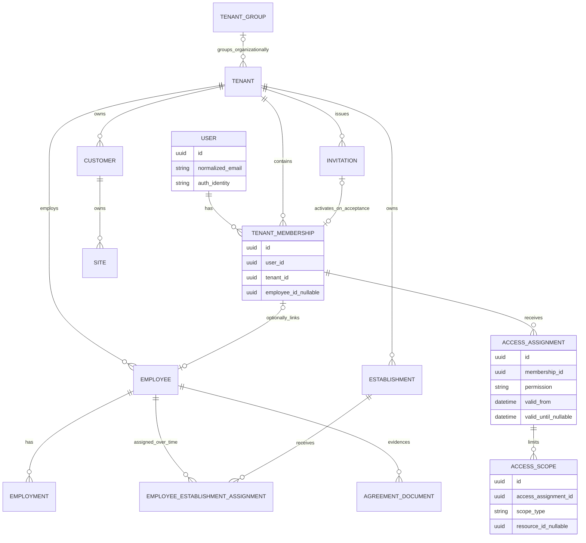
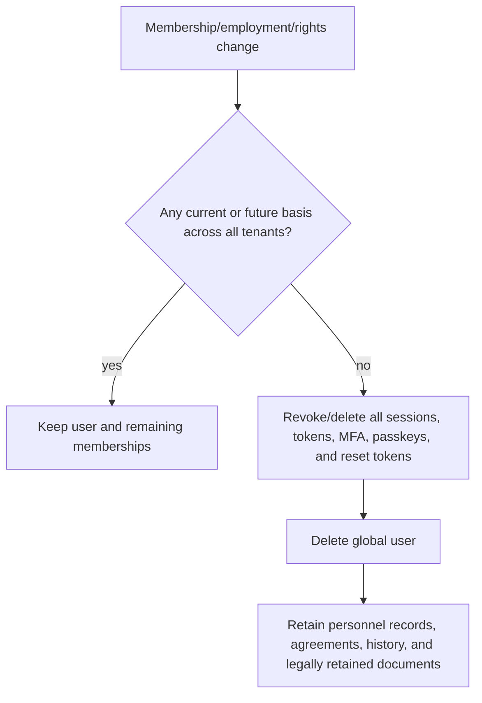

<!--
SPDX-FileCopyrightText: 2026 SecPal Contributors
SPDX-License-Identifier: CC0-1.0
-->

# ADR: Tenant, Identity, Employee, and Access Model

- **Status:** Accepted — binding target architecture
- **Date:** 2026-07-20
- **Scope:** Cross-repository functional and technical baseline for the subsequent redesign

## Context and problem statement

SecPal is at version 0.x and has neither production data nor compatibility requirements. The redesign will therefore establish a clean baseline using `migrate:fresh --seed`. Existing-installation migrations, transitional tables, dual writes, and old API aliases are explicitly excluded.

The current state conflates global identity, tenant assignment, employment, and access. For example, `api/app/Models/User.php` requires `tenant_id` on the user, while `api/app/Http/Middleware/InjectTenantId.php` derives context from it. In parallel, `api/app/Http/Middleware/SetTenant.php` accepts tenant values from a route or `X-Tenant`. `LegalEntity`, `OrganizationalUnit`, its closure table, and `UserInternalOrganizationalScope` add further layers that conflict with the target model. For these subjects, this ADR supersedes `.github/docs/adr/20251219-user-based-tenant-resolution.md`, `20251126-organizational-structure-hierarchy.md`, `20251221-inheritance-blocking-and-leadership-access-control.md`, and `20251227-simplify-management-level-to-integer-field-adr011.md`.

## Binding decisions

### Domain boundaries

| Layer                 | Binding meaning                                 | Must not mean                                 |
| --------------------- | ----------------------------------------------- | --------------------------------------------- |
| Global User           | Global authentication identity                  | Tenant, functional role, permission, or scope |
| Tenant                | Exactly one legal entity/company                | Group of legal entities or an establishment   |
| TenantMembership      | Only User–Tenant assignment and context carrier | Automatic functional authorization            |
| Permission Assignment | Permits an action for a membership              | Data scope or membership lifetime             |
| Scope                 | Limits a permitted action to data/resources     | Permission or hierarchy                       |
| Employee              | Tenant-bound personnel record                   | Global identity or source of authorization    |
| Employment            | Current/future employment relationship          | Legal termination based on a draft alone      |
| Establishment         | Tenant establishment                            | Separate tenant or legal entity               |
| Customer/Site         | Tenant customer and customer site               | Automatic document access                     |

### Tenant, legal entity, and provisioning

A tenant represents exactly one legal entity or company. Legal entities exist only at tenant level. `LegalEntity` and every `legal_entity_id` reference are removed completely. An optional `TenantGroup` may group tenants for organizational purposes only; it creates neither rights nor inheritance.

Tenants are provisioned exclusively through a privileged Artisan command. There is no user permission and no API endpoint for creating a tenant. The command creates the tenant and minimally required technical initial data, but no implicitly privileged membership.

### Global identity and membership

`User` is global and may exist without a tenant assignment, for example until an invitation is accepted and registration completes successfully. Its data is limited to authentication, normalized email, MFA, passkeys, language, global blocking, and comparable identity characteristics. `users.tenant_id` is removed. No individual identity has a special status or policy bypass.

Only `TenantMembership` assigns a user to a tenant; `(user_id, tenant_id)` is unique. It may optionally link to exactly one employee in the same tenant. A user may link to different employee records in different tenants. A membership is not a permission.

A membership exists only while at least one basis is current or future:

1. a current or future employment relationship in the tenant; or
2. at least one current or future rights assignment in the tenant.

Without both bases, it ends. An external user may therefore exist without an employee; an employee may exist without a user or membership.

### Active tenant context

The active context is the concrete valid `TenantMembership`, stored in the browser session or the access-token/device context. It is never resolved from a URL, `/tenants/{tenant}/…`, `X-Tenant` header, payload, query, or `users.tenant_id`. On every request, the server verifies that the stored membership remains valid and belongs to the authenticated user.

When exactly one valid membership exists, the system activates it automatically. When several exist, the user chooses `ask` (choose after sign-in) or `resume_last` (open the last still-valid membership for that session/device) in their profile. Invalid or ended memberships require a new choice. Every switch revokes or clears tenant-dependent role, permission, scope, UI, offline, and server caches before data from the new context becomes visible.

### Permissions, scopes, and delegation

All functional roles and permissions are tenant-specific and assigned exclusively to a membership. Assignments may be current, future, time-limited, revoked, or expired. The model strictly separates:

- **Permission:** Which action is allowed?
- **Scope:** Which data/resources does that action apply to?
- **Validity:** The assignment's `[valid_from, valid_until)` interval.

Scopes support at least tenant-wide access, an individual establishment, an individual customer, and an individual `Site`; one assignment may contain several concrete target resources. Examples include `employees.read` for Bremen, `guardbook.write` for Airport, `site_documents.read` for selected customer sites, and explicitly assigned tenant-wide access. A permission without an applicable scope permits no functional action; a scope without a permission does not either. Employee status, establishment assignment, position, management level, and contract never grant rights automatically.

Inviting requires an explicit tenant-specific permission. Assigning roles, permissions, or scopes requires separate explicit permissions; `memberships.invite` alone must not grant arbitrary rights. Delegation is limited to the assigner's own membership and tenant. The first membership receives no implicit special position.

### Employee, employment, contract, and establishment

An employee is exactly one personnel record in exactly one tenant and remains when its linked global user is deleted. The current projection may keep current contract data directly on the employee. Multiple contract documents, amendments, and other agreements are historical/documentary records; there is no general table for several simultaneously active employment contracts.

During a current employment relationship, an employee has exactly one current establishment assignment. It is historized, may not overlap for an employee, and uses `[valid_from, valid_until)`. During a future relationship, a suitable future assignment must be schedulable. History creates no current rights. Establishments belong to exactly one tenant, are not legal entities, and may be closed/deactivated but must not be hard-deleted when relevant history exists.

Termination workflows have separate states for draft, approval, printing, signature, dispatch, receipt, notice expiry, and employment end. A digital draft alone never establishes legal employment termination. A scan of the signed original may be added to the personnel record later.

### Invitations, membership end, and deletion

An invitation is tenant-bound, one-time, time-limited, and token-based; tokens are stored only as hashes. It is not an active membership. Inviting performs a global normalized-email lookup without unnecessarily disclosing to the inviter whether an account exists. An existing user accepts using their account; a new user receives a registration link and is only created after successful completion. Acceptance atomically creates/reactivates the membership and planned rights. Invitations and planned rights may have separate validity periods.

When the last current or future employment relationship ends and no current or future rights remain, the membership ends. When no current or future membership basis remains across all tenants, the global user is deleted. Before deletion, sessions, access and reset tokens, MFA, passkeys, and other credentials are revoked or deleted. Personnel records, agreements, establishment history, and legally retained documents remain. The check is centralized and tenant-spanning; one expiring personnel record must not delete a user who still has a basis elsewhere.

A future customer user remains a global user with membership in the security company's tenant and Customer/Site scopes. A customer does not thereby become a tenant. Scopes do not make documents generally visible; explicit approval or visibility classification is additionally required.

## Tenant provisioning through Shell

Provisioning is an exclusively privileged operational process and runs only through an Artisan command. The command name, parameters, operational authorization, and seed content remain open and are intentionally not pre-decided. Binding requirements are: the command creates one tenant as the sole legal entity and audits execution; neither a functional permission nor an HTTP interface may create a tenant. It automatically grants no rights to a user identity or membership.

## Domain overview



`TenantGroup` intentionally has no edge to `ACCESS_ASSIGNMENT`. `LegalEntity`, `OrganizationalUnit`, the closure table, `UserInternalOrganizationalScope`, reporting relations, and simultaneous current establishment assignments for one employee are not modeled and are prohibited.

## Authentication and tenant-selection flow

```mermaid
sequenceDiagram
    participant U as User
    participant C as Browser/App
    participant A as Auth service
    participant M as Membership service
    participant S as Session/Token context
    U->>C: sign in
    C->>A: authenticate
    A->>M: determine valid memberships
    alt exactly one
        M-->>S: store that membership as active
    else several + ask
        M-->>C: offer selection
        U->>C: choose membership
        C->>S: activate selected membership
    else several + resume_last
        M->>S: check last valid membership
        alt valid
            S-->>C: last membership active
        else invalid
            M-->>C: offer selection
        end
    else none
        M-->>C: no tenant context; global flows only
    end
    C->>A: functional request
    A->>S: validate active membership
    A->>M: validate permission + scope + validity
    M-->>A: allow/deny
    A-->>C: tenant-isolated response
    Note over C,S: Switching clears all tenant-dependent caches
```

## Invitation, membership, and deletion lifecycles

### Invitation flow

```mermaid
sequenceDiagram
    participant I as Inviting membership
    participant S as Invitation service
    participant U as Global user
    participant R as Registration
    I->>S: invite with tenant-specific permission
    S->>S: normalize email; hash token; store expiry
    alt User exists
        S-->>U: neutral acceptance message
        U->>S: accept using existing account
    else User does not exist
        S-->>R: registration link
        R->>S: complete registration successfully
    end
    S->>S: atomically create/reactivate membership + planned rights
    S-->>U: membership can now become active
```

### Membership lifecycle

`planned → active` occurs only after successful acceptance and within the applicable validity windows. A central lifecycle service evaluates the two bases after every Employment or Access Assignment change and on schedule. If neither is current nor future, it sets `ended`, invalidates context, and revokes cached data. Reactivation is possible only through a new/accepted invitation or a newly existing basis and is audited.

### User-deletion lifecycle



## Data protection, audit, and retention boundaries

Retention is modeled per document/data category, at minimum with `retention_class`, `retention_until`, `legal_basis`, and optionally `legal_hold_until`. No global retention period may delete a whole personnel record indiscriminately. Data-protection retention details must be separately validated as compliance requirements before implementation; this ADR defines no retention periods.

Audit records tenant switches, invitations, rights grants/revocations, membership end, user deletion, and termination-workflow state transitions without unnecessarily duplicating sensitive content. Records reference actors and objects, not plaintext secrets or complete personnel documents.

## Consequences

Positive consequences are clear tenant isolation, multi-tenant identities without duplicates, no implicit rights derivation, time-resilient authorization, and legally separated HR lifecycles. Customer-portal capability remains possible without a separate customer tenant.

Negative consequences are new central context infrastructure, more explicit assignment and deletion checks, demanding atomic invitation transactions, and compulsory cache invalidation on context switch. These costs are accepted because they keep the functional layers separate.

## Explicitly rejected alternatives

- A user with exactly one tenant or `users.tenant_id` as primary context.
- Tenant resolution from a route, subdomain, `X-Tenant`, request payload, or query.
- Global functional roles/permissions or special roles/statuses.
- `LegalEntity` or several legal entities within one tenant.
- `OrganizationalUnit`, replacement hierarchies, closure table, `UserInternalOrganizationalScope`, management/reporting lines.
- Parallel current establishment assignments for an employee or rights derived from employee properties.
- An invitation as an immediately effective membership.
- User deletion because of one employee record.
- Backward-compatibility layers, transitional tables, dual writes, and deprecated aliases.

## Cross-repository impact inventory

### `SecPal/api`

- **Current state/domains affected:** `app/Models/User.php`, `TenantKey.php`, `LegalEntity.php`, `OrganizationalUnit.php`, `OrganizationalUnitClosure.php`, `UserInternalOrganizationalScope.php`, `Employee.php`, `Establishment.php`, `Customer.php`, `Site.php`, `TemporalRoleUser.php`, `CustomerAssignment.php`, and `SiteAssignment.php` partly conflate users, tenants, organizational units, and domain scope.
- **API/authentication:** `routes/api.php`, `app/Http/Middleware/InjectTenantId.php`, `SetTenant.php`, and `AuthController.php` must move to membership context. `/tenants/{tenant}` routes and `X-Tenant` resolution are removed. `app/Policies/*`, `RoleController.php`, `Api/V1/UserPermissionController.php`, and `config/permission.php` must authorize memberships rather than users.
- **Deprecated components to remove:** Models, migrations, factories, seeders, requests, resources, policies, services, and endpoints for legal entities/organizational units/closure/organizational scope; especially `OrganizationalUnitAccessService.php`, `OrganizationalScopeEntitlementService.php`, `OrganizationalUnitAssignmentService.php`, `CheckOrganizationalScope.php`, and `AssignableOrganizationalUnit.php`. `legal_entity_id` is also removed from Employee/Customer/Establishment.
- **New components expected:** TenantMembership, Access Assignment/Scope, Invitation, Employment, EmployeeEstablishmentAssignment, contract/agreement and termination workflow, central tenant-spanning lifecycle service, and membership context for session, Sanctum token, and device.
- **Risk/tests:** `tests/Feature/SetTenantMiddlewareTest.php`, `InjectTenantIdMiddlewareTest.php`, `UserTenantRelationshipTest.php`, organizational-unit/legal-entity migration and policy tests, `RoleApiTest.php`, `UserPermissionAssignmentApiTest.php`, `TemporalRoleUserTest.php`, employee lifecycle, and cross-tenant tests must be replaced. Context confusion, atomic invitations, and credential revocation are the primary risks.

### `SecPal/contracts`

- **Current state/schema:** `docs/openapi.yaml` describes `tenant_id`, `legal_entity_id`, organizational units, user roles/permissions, and legacy employee/customer/site assignments, including `EmployeeCreateRequest`, `Employee`, `Customer`, and organizational-unit schemas.
- **API endpoints:** Documented organizational-unit, legal-entity lookup, user-role/permission, and tenant-path endpoints are removed or replaced by membership, context-switch, invitation, and scoped-access endpoints; exact operation names remain open.
- **New components expected:** Contracts for active membership, selection/switching, invitation acceptance, time-bound Access Assignments with scopes, employment/establishment history, document visibility, and termination states.
- **Risk/tests:** Generators and drift checks in `scripts/check-domain-contracts.mjs`, `scripts/check-openapi-verified-endpoints.mjs`, and their tests must express the breaking baseline. No alias is retained for old fields or endpoints.

### `SecPal/frontend`

- **Current state:** `src/types/api/openapi.generated.ts` contains organizational-unit and legal-entity contracts; `src/components/Organizational*`, `src/hooks/useOrganizationalUnitsWithOffline.ts`, `src/pages/Organization/OrganizationPage.tsx`, and their tests must be removed. Employee, Customer, and Site pages contain legal-entity/organizational-unit assumptions, for example `src/components/CustomerEstablishmentFields.tsx` and `src/components/DomainAssignmentFields.tsx`.
- **Authentication/context:** `src/contexts/AuthContext.tsx`, `src/lib/offlineSessionState.ts`, `src/lib/clientStateCleanup.ts`, `src/components/PermissionRoute.tsx`, and `src/components/OrganizationalRoute.tsx` require membership selection, context switching, and complete tenant-dependent cache clearing.
- **New components expected:** Profile UI for `ask`/`resume_last`, membership selection, invitation/registration, rights/scope management with validity periods, establishment history, and secure document visibility.
- **Risk/tests:** Offline vault and IndexedDB must show no data after a tenant switch. AuthContext, offline-session, cache-cleanup, guard, and removed organizational-unit tests must be replaced by context-isolation, switching, and scope tests.

### `SecPal/android`

- **Current state:** `docs/ANDROID_AUTH_ARCHITECTURE.md` requires bearer tokens and `GET /v1/me`; `android/app/src/main/java/app/secpal/KeystoreTokenStorage.java`, `NativeAuthHttpClient.java`, `SecPalNativeAuthPlugin.java`, `ProvisioningBootstrapCoordinator.java`, and `src/secpal/native-auth-bridge.ts` manage tokens, bootstrap, and logout.
- **Impact:** The token/device-context format must securely bind or reference an active membership; switching and revocation clear token- and tenant-dependent native/browser caches. Provisioning remains permission-gated but must not treat tenant context from QR/URL as authorization evidence.
- **Risk/tests:** Keystore-token, native-auth, bootstrap, and logout tests must prove membership switches, invalid memberships, and credential revocation. The native security boundary remains intact; tokens are never made available to JavaScript.

### `SecPal/secpal.app`

- **Current state:** The public website has no functional tenant/HR domain; relevant files are only references and privacy text, including `src/components/Nav.astro`, `src/i18n/de.ts`, `src/i18n/en.ts`, `src/pages/de/privacy.astro`, and `src/pages/en/privacy.astro`.
- **Impact:** This ADR requires no application redesign here. Before a public invitation/registration page is built, it must be decided whether it remains on `app.secpal.dev`; the public site must disclose neither tenant context nor account existence.
- **Risk/tests:** Domain and copy tests must not introduce impermissible tenant resolution or data-protection promises.

### `SecPal/.github`

- **Current state:** The earlier ADRs named above and `docs/adr/README.md` describe superseded decisions. `docs/openapi.md`, `docs/legal-compliance.md`, `docs/feature-requirements.md`, and checks such as `scripts/check-openapi-verified-endpoints.mjs` may contain references.
- **Impact:** After API/contract implementation, the ADR index and superseded references must be marked consistently and architecture/compliance documentation and validation rules updated. No change is made there in this work item.
- **Risk/tests:** Contradictory old ADRs and CI checks must not reject the new baseline.

## Open detail decisions before implementation phases

1. Physical names, key types, constraints, and delete/soft-delete semantics of new tables.
2. Whether roles are only bundles of tenant-specific permissions and how their templates are provisioned; no global functional role.
3. Exact scope representation (polymorphic target versus separate tables) and rules for several scope targets per assignment.
4. Exact meaning of “current” for time zones, jobs, `valid_until`, and future invitations/rights.
5. Token/session model: membership ID in token, server-side context reference, or both; rotation and revocation propagation.
6. Behaviour of open sessions/offline data on switching and on subsequent rights revocation.
7. Minimum set of delegable permissions and whether an assigner may grant only equally or more narrowly scoped rights.
8. Complete Employment state machine and authoritative evidence for termination receipt, notice expiry, and employment end.
9. Data categories, visibility classifications, legal bases, retention rules, and legal-hold process after compliance validation.
10. Public invitation/registration URLs and UX, rate limits, and abuse prevention without disclosing account existence.
11. Tenant-command interface, operational authorization, seed content, and provisioning audit.
12. Concrete customer-portal document approvals and whether customer users may access additional tenants.

## Implementation order

1. Define target contracts and data model as the new baseline.
2. Implement and isolate-test API context, membership/lifecycle, and authorization.
3. Implement frontend context, cache clearing, and new flows against the contracts.
4. Adapt Android token/device context and revocation.
5. Align documentation, older ADRs, checks, and public text.

None of these phases introduces compatibility mechanisms for concepts rejected by this ADR.
